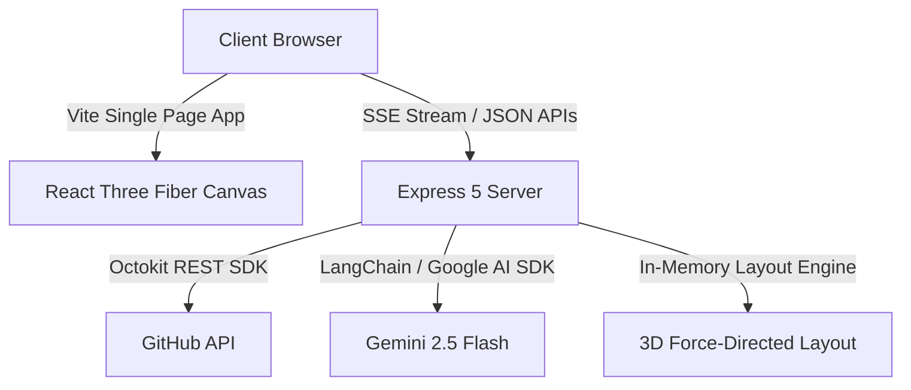

# ETHER — Codebase as a 3D Universe

ETHER is an interactive 3D universe visualizer that transforms any GitHub repository into a fully explorable star system. 

- **Files are Stars**: Size corresponds to file complexity, while color encodes the file type.
- **Constellations and Systems**: Nested folders cluster together in 3D space.
- **Gravitational Connections**: Structural lines display relative dependency imports.
- **Supernovas and Pulsing Orbs**: Recently modified files pulse to highlight activity.
- **Interactive AI Navigator**: Flight assistant powered by Gemini to help you query the codebase, locate subsystems, and inspect dependencies.

---

## Architecture



- **Frontend**: React 19, React Three Fiber, React Three Drei, PostProcessing (selective Bloom), Tailwind CSS, React Router v7, Zustand, TanStack Query.
- **Backend**: Express 5, Octokit (GitHub API provider), Barnes-Hut/Force-Directed 3D coordinates layout engine, Gemini AI Navigator service, Server-Sent Events (SSE).

---

## Getting Started

### Prerequisites

- Node.js >= 20
- npm >= 10

### Installation

1. Clone the repository and install dependencies:
   ```bash
   git clone https://github.com/your-username/ether.git
   cd ether
   npm install
   ```

2. Copy the environment configuration:
   ```bash
   cp .env.example .env
   ```

3. Configure your API keys in `.env`:
   - `GITHUB_TOKEN`: Required to fetch private repositories or bypass public rate limits.
   - `GEMINI_API_KEY`: Required to activate the AI Spacial Navigator.

### Local Development

Start both the client and server concurrently:
```bash
npm run dev
```

- **Client SPA**: `http://localhost:5173`
- **Express API**: `http://localhost:3001`

---

## Production Deployment

### Docker Deployment (Recommended)

1. Build the production image:
   ```bash
   docker build -t ether:latest .
   ```

2. Run the container:
   ```bash
   docker run -p 3001:3001 --env-file .env ether:latest
   ```

3. Access ETHER at `http://localhost:3001`.

### Manual Build

Compile both frontend static files and verify TypeScript types:
```bash
npm run build
```
Start the production server:
```bash
NODE_ENV=production npx tsx server/index.ts
```

---

## Quality and Controls

ETHER features automatic and manual visual rendering throttling to guarantee 60 FPS on low-power devices:
- **High Preset**: Anti-aliasing, selective Bloom post-processing, dependency lines, and background particles.
- **Balanced**: Reduced density, standard canvas DPR.
- **Low**: Disables post-processing, particle systems, and renders flat star nodes.

---

## Interactive Controls

- **Orbit / Rotate**: Left Click + Drag
- **Move / Fly**: WASD + QE (Vertical movement)
- **Speed Boost**: Hold Shift while flying
- **Zoom**: Scroll Wheel
- **Inspect Node**: Double-click on any star
- **Quick Search**: `⌘K` or `Ctrl+K` to search by path name
